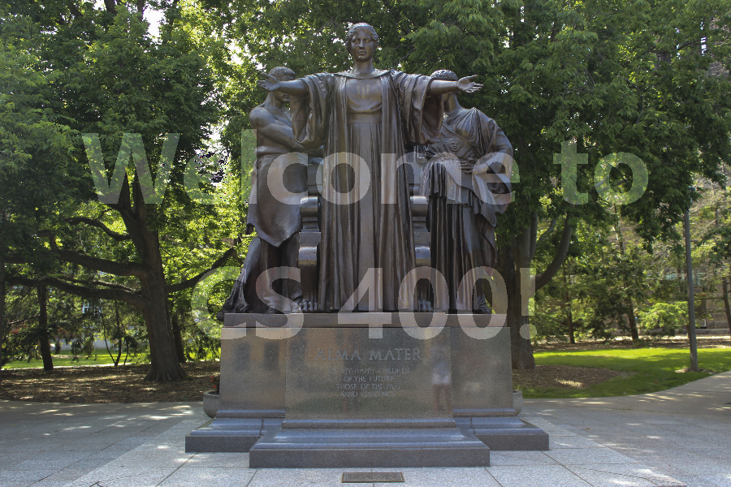

# Image-Transform
## C++ Application to transform an image in different ways, like Grayscale, Spotlight, Changing Hue, Watermark. 
### The Read and Write operation on Image is done by LodePNG 
> LodePNG is a PNG image decoder and encoder C++ library
#
| Spotlight             | Illinify              |
| :---:                 | :---:                 |
| |  |

| GrayScale             | Watermark             |
| :---:                 | :---:                 |
| | |

| Original Image        | Watermark Stencil     |
| :---:                 | :---:                 |
|          |       |
